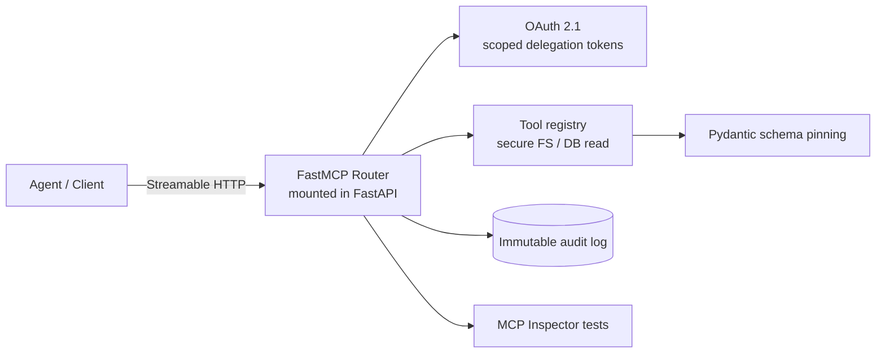

# secure-mcp-router

> Secure, distributed Model Context Protocol (MCP) tool router — FastMCP mounted in FastAPI over Streamable HTTP, with OAuth 2.1 scoped delegation, OWASP MCP Top 10 hardening, and MCP Inspector testing.

**Status:** 🚧 In active development (Days 23-29 build sprint) · **Repo:** `github.com/prem-pjena/mcp-cost-router`

---

## Why this exists

Autonomous agents need a safe, auditable way to call enterprise tools. Vanilla MCP servers expose tools with weak auth and no hardening — a poisoned tool definition, an over-privileged token, or a tampered audit trail is a real incident waiting to happen.

This project builds a **production-minded MCP router** that treats tool access as infrastructure: least-privilege auth, schema pinning, immutable logging, and verified safety — not a toy demo.

## Architecture



## Key design decisions

- **Streamable HTTP (not SSE)** — production-grade remote MCP transport: one long-lived request/response model, built for real deployments instead of demo-only Server-Sent Events.
- **OAuth 2.1 scoped delegation (RFC 7523)** — machine-to-machine auth for agents. Clients sign a short-lived JWT with a private key as identity proof → least-privilege, revocable scopes. No static client secrets.
- **Pydantic schema pinning (OWASP MCP05)** — tool inputs are strictly validated against pinned schemas, blocking tool-poisoning / command-injection through malformed tool definitions.
- **Immutable audit logging** — tamper-evident, sequence-level trail of every tool call: who, what scope, when, and the result. Non-repudiation for regulated deployments.
- **OWASP MCP Top 10** — hardening mapped to MCP01 (authentication), MCP03 (tool poisoning), MCP05 (schema validation), MCP08 (access control) as the core threat model.

## Tech stack

FastAPI · FastMCP · Streamable HTTP · OAuth 2.1 (JWT / RFC 7523) · Pydantic v2 · Python · Docker

## Project structure

```
mcp-cost-router/
├── core/           # MCP server bootstrap, config, auth wiring
├── routers/        # FastAPI mount points + Streamable HTTP transport
├── tools/          # Tool registry: secure FS, DB read
├── services/       # OAuth 2.1 delegation, audit logging
├── models/         # Pydantic schemas (MCP05 pinning)
├── tests/          # MCP Inspector + pytest integration tests
├── Dockerfile
└── docker-compose.yml
```

## Getting started

*(Fill in as the build completes — currently Days 23-29. Once the scaffold is in place, this section will cover: clone → env config → `docker-compose up` → MCP Inspector run.)*

```bash
# Planned (once scaffold lands):
# git clone https://github.com/prem-pjena/mcp-cost-router.git
# cd mcp-cost-router
# cp .env.example .env
# docker-compose up --build
```

## Roadmap

- [x] Repo scaffold + project structure
- [ ] FastMCP scaffold + Streamable HTTP transport
- [ ] OAuth 2.1 scoped delegation tokens
- [ ] Tool registry (secure FS, DB read)
- [ ] Pydantic schema validation (MCP05)
- [ ] Immutable audit logging
- [ ] MCP Inspector integration tests
- [ ] Code freeze + Docker deploy + technical README

## Security posture

- Least-privilege by default: every tool call is scope-checked before execution
- Schema-pinned tool definitions: malformed/poisoned definitions rejected at the boundary
- Tamper-evident audit trail: any attempt to rewrite history is detectable
- Verified via MCP Inspector integration tests before release

---

Built as part of a backend-first AI engineering sprint. Focus: making agent tool-calling safe, auditable, and production-ready.
